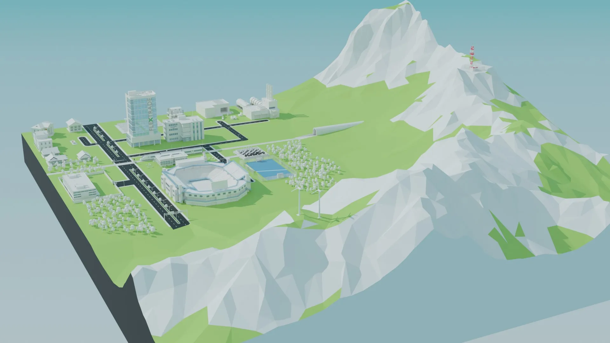
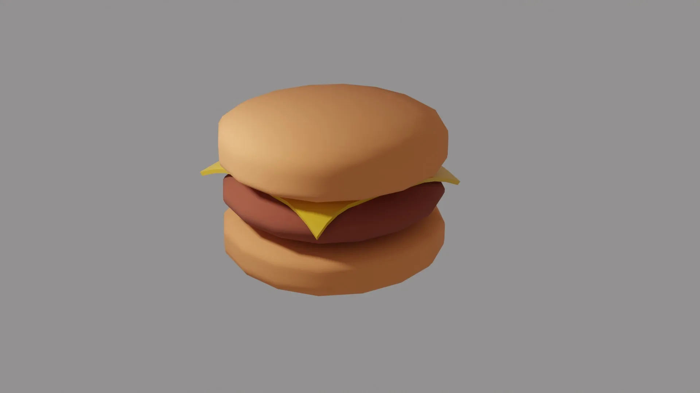
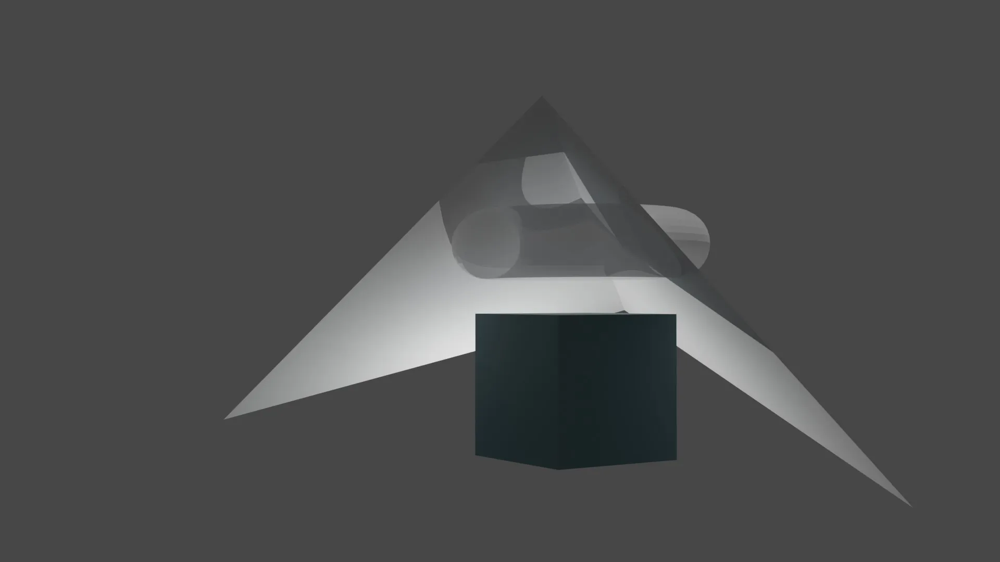

# Blender Models

This project is a collection of Blender models and 3D assets I've created over time. It started as a way to apply version control to my creative work. Coming from software engineering, version control had already become a habit, so it felt natural to bring that mindset into 3D modeling too.

I'm still fairly new to the space, so the collection is small for now, but it's steadily growing. Each piece reflects a different point in the learning curve. Here are a few of my early creations:

---

## Low Poly City

A stylized miniature city. This was my first big model, and I built it to serve as the centerpiece of my Three.js portfolio

	

---

## Burger

Built while following Bruno Simon's Three.js course. He walks through the steps of modeling a burger, and I ended up with this tasty low-poly classic

	

---

## Random Polygons

My very first render. I didn't know what I was doing yet and I just kept experimenting until it looked cool. It's also the only one that still features the default cube, so it holds a special place in my heart

	

